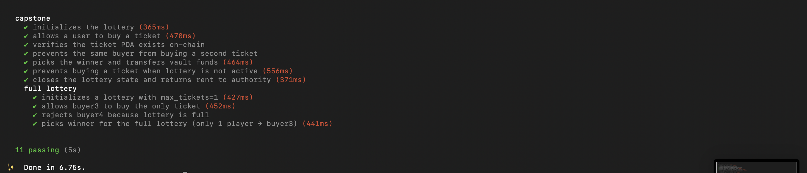

https://drive.google.com/file/d/1TtXJuj2Q-baX5Y8oFCvJCLiH7-IXO1Aw/view

# Capstone — Solana Lottery Program

An on-chain lottery built with Anchor on Solana.

## Features

- Initialize a lottery with a ticket price, max tickets, and end time
- Users buy tickets (SOL transferred to a vault PDA)
- Each buyer gets a unique ticket PDA — prevents double-buying
- Authority picks a winner using on-chain pseudo-randomness (slot hashes + clock)
- Winner receives the entire vault balance
- Authority closes the lottery state to reclaim rent

## Program Instructions

| Instruction     | Description                                             |
|-----------------|---------------------------------------------------------|
| `initialize`    | Create lottery state with price, max tickets, end time  |
| `buy_ticket`    | Purchase a ticket and store buyer in state + ticket PDA |
| `pick_winner`   | Pick a random winner and transfer vault funds           |
| `close_lottery` | Close the lottery state account after winner is picked  |

## Deployment

**Network:** Devnet
**Program ID:** `ErJRFMPZdb32PbxopbmhmvMwxFudJD23XbfMdF8Z27AW`
**Deploy Signature:** `55hjT4rwwacxjLZxSnEdK39NgB63mtDnAp4bJweMFbSWEUwMEh8mRu1uDuEkhCNDZwDxnMzE2mZfHNqs77SNnksv`

## Test Proof

